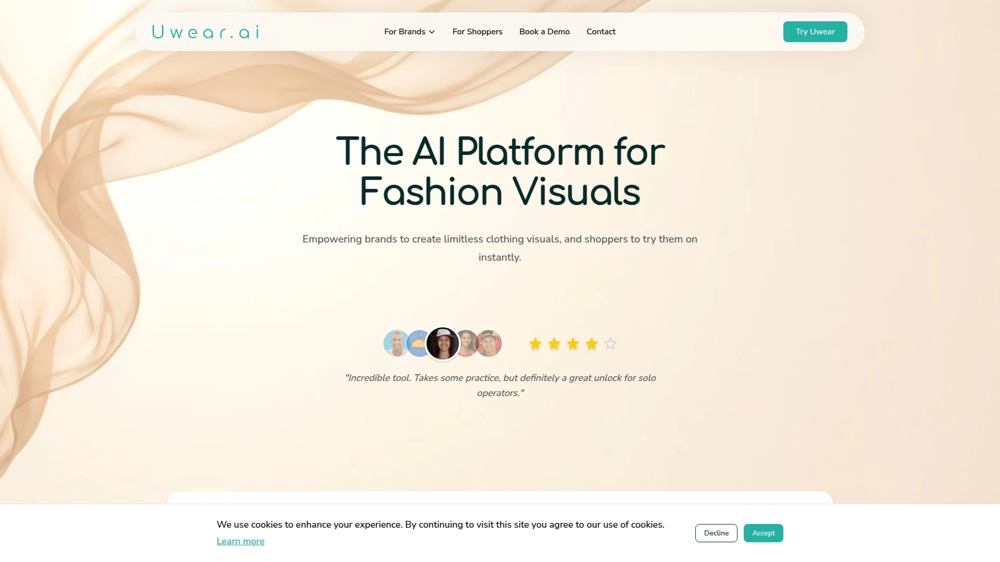
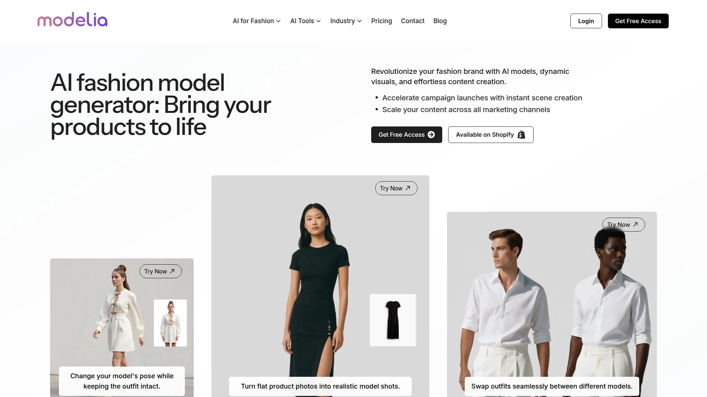
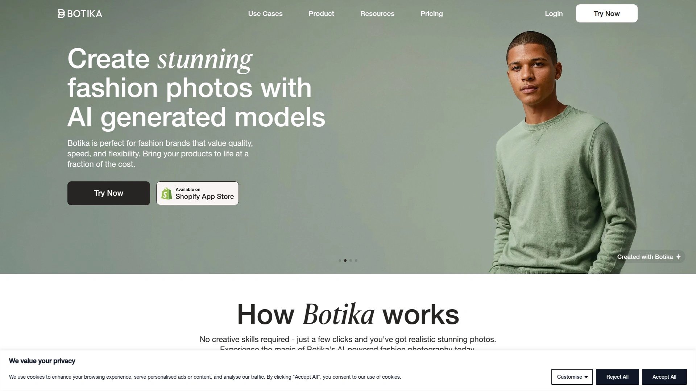
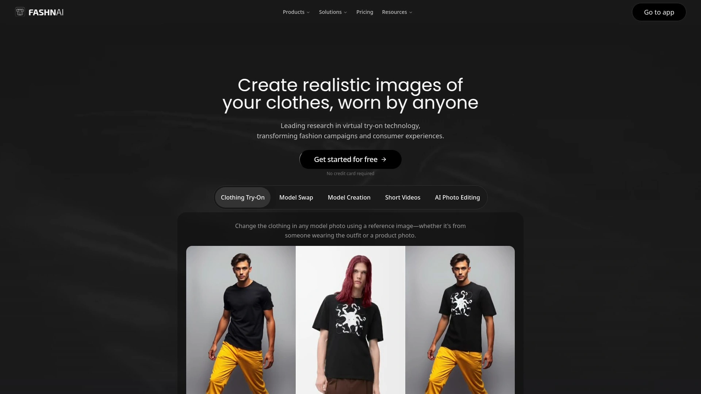
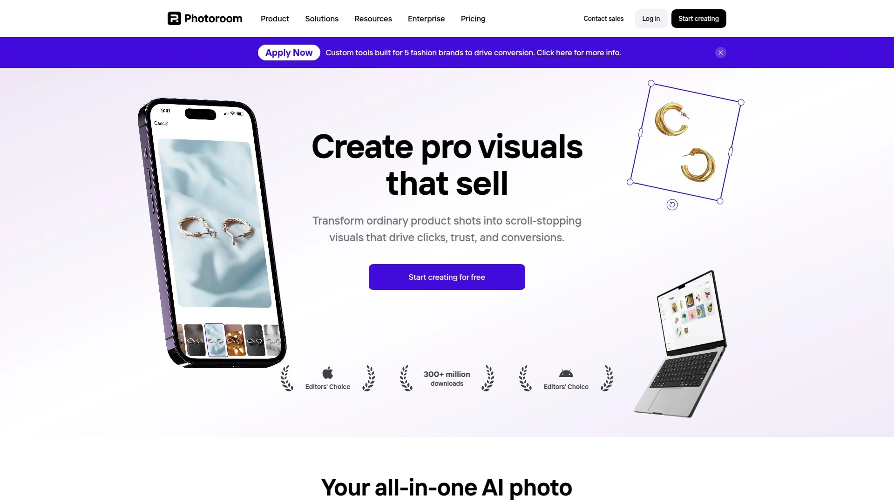
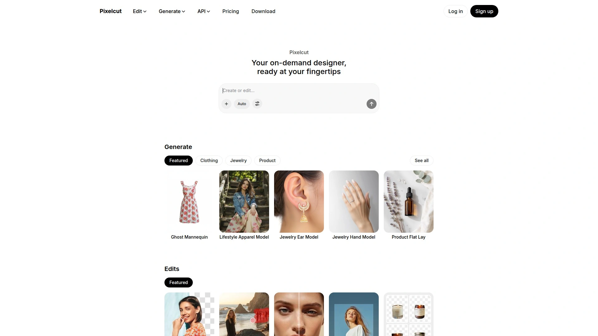
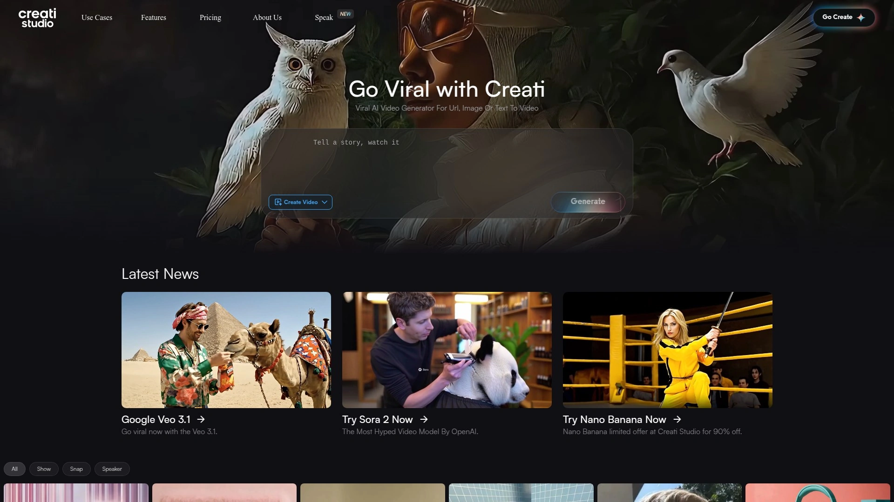
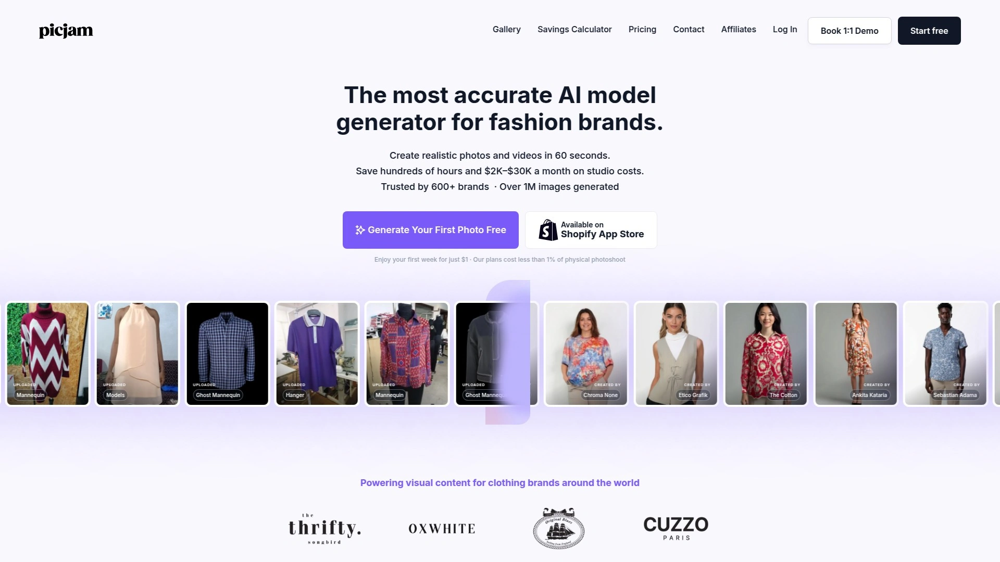
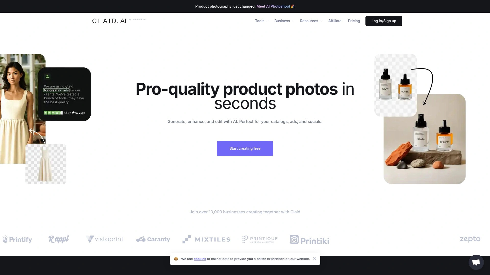
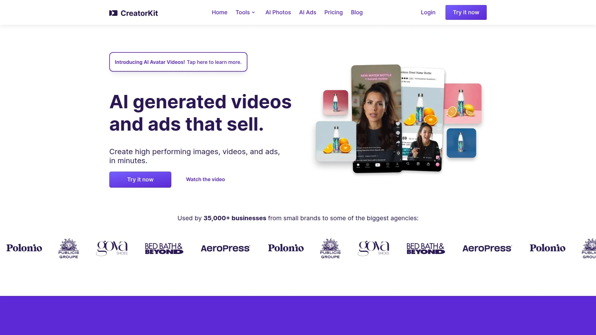

# Learn These 10 AI Fashion Photography Tools, Complete Product Shoots in Five Minutes

Scheduling photoshoots with models, photographers, makeup artists, and studios feels like coordinating a space launch—expensive, complicated, and prone to last-minute cancellations when your lead model gets food poisoning. AI fashion photography platforms eliminate this chaos by transforming flat-lay clothing photos into professional on-model images in seconds, no humans required. Modern AI generates realistic virtual models wearing your products across diverse body types, skin tones, and poses—complete collections shot in the time it used to take booking one photographer.

Whether you run a small boutique or manage hundreds of SKUs for major retailers, these tools turn simple product photos into conversion-driving fashion imagery that looks professionally shot. The best platforms handle everything from basic model generation to advanced editing, video creation, and even customer virtual try-on experiences. Fashion brands using AI photography report cutting content production costs by 90% while dramatically accelerating time to market for new collections.

## **[Uwear.ai](https://uwear.ai)**

Complete AI fashion photography platform transforming flat-lays into limitless on-model visuals in seconds.

Uwear.ai empowers brands to create unlimited clothing visuals from single flat-lay images with no expensive photoshoots, 3D designs, or mannequins required. Simply snap a photo of your item, upload it, and generate your first professional fashion image within five seconds. This extreme simplicity removes technical barriers that make competing platforms feel overwhelming for small teams without dedicated designers.

The platform offers access to cutting-edge AI image models including Gemini and Seedream, plus proprietary technology like their Drape system. Each model has unique strengths optimized for different fashion photography needs—you get best results for every project by selecting the right AI for specific garment types or visual styles. Multiple model options ensure you're never locked into one algorithm's limitations when another might handle your specific fabric or pose better.

**Virtual model diversity and customization:** Create unlimited AI-generated fashion models showcasing your clothing line with realistic rendering that looks professionally photographed. Advanced AI technology produces virtual models wearing products perfectly across different body types, ethnicities, and poses, appealing to your entire customer base without hiring dozens of real models. You can also upload your own models if you have image rights, maintaining brand consistency when you've already established signature faces.

Batch processing generates hundreds of images simultaneously rather than one at a time, which matters when launching new collections with dozens of SKUs. Create engaging videos showing how products move and drape, providing customers motion context that static images can't convey. Upscaling to 4K resolution ensures images work for everything from mobile shopping to large-format retail displays. AI edits transform existing fashion images with precision—change poses, add accessories, swap clothing items using Gemini Flash or Seededit models.

**API integration for developers:** Integrate AI-powered fashion photography directly into your applications and generate photos and videos programmatically in minutes. Complete feature parity means all Studio capabilities are accessible through code—batch processing, video creation, model management, edits, upscaling, everything. Export complete API specs in JSON format optimized for LLMs, feed them to ChatGPT or Claude, and instantly build custom integrations tailored to your exact needs. Documentation designed for both human developers and AI assistants accelerates implementation.

New users receive free credits to test the platform without credit cards. After free trials, transparent pay-as-you-go pricing charges just $0.10 per credit with no subscriptions, no commitments, and credits that never expire. This pricing model beats monthly subscriptions for seasonal businesses or brands with irregular photo needs. Uwear.ai also offers a mobile app for shoppers to create personal AI avatars and virtually try clothes before buying, with AI color analysis determining which colors flatter individual skin tones.

One customer testimonial captures the transformation: "This platform has completely transformed our studio photo operations. We still shoot real photos, but I expect we will be 100% virtual by 2026". For fashion brands wanting comprehensive AI photography covering generation, editing, video, and customer try-on through one platform, Uwear.ai's complete ecosystem handles the entire visual content pipeline.

## **[Modelia.ai](https://modelia.ai)**

Studio-grade AI fashion model generator with over 100 customizable virtual models and real-time editing.

Modelia specializes in applying advanced AI technology to create stunning, realistic images helping fashion brands elevate visual content. The platform reduces costs, time, and expertise needed for creating personalized, diverse, context-rich, high-quality images for ecommerce. Studio-grade quality distinguishes Modelia from competitors producing mid-range outputs that look obviously AI-generated.

Three-step generation process starts by selecting the garment you want dressed with an AI fashion model—use high-resolution images where garments are fully visible and unobstructed for best results. Customize your model by selecting age, gender, ethnicity, and more, plus define backgrounds from solid colors to complex scenes. Click generate and the system creates four images featuring AI fashion models based on your specifications, each with different fittings so you choose the one meeting your needs.

**Creative control and output diversity:** Over 100 diverse and customizable models provide extensive options across ethnicities, body types, and poses. Choose outfits, mood, lighting, and poses rather than accepting automated generation with no input. This creative direction matters for brands with established visual identities requiring consistent aesthetic across all marketing. Full white-label support and API integration enable agencies and larger operations to embed Modelia into existing workflows.

Output types include images, videos, and virtual try-ons rather than limiting you to static photos. Editing tools adjust lighting, skin tones, and backgrounds after initial generation, fine-tuning results without starting over. These capabilities exceed platforms offering automated generation with no editing or customization. Modelia suits marketplaces, DTC brands, luxury fashion, and social commerce applications requiring versatility.

Pricing transparency with tiered plans and free trials lets you test before committing to paid subscriptions. The platform handles creative automation and content publishing, pushing updates and testing creative assets within the system rather than requiring external tools. For fashion businesses prioritizing visual content creation, brand aesthetics, and speed to market, Modelia delivers comprehensive creative capabilities.

## **[Botika.io](https://botika.io)**

Fast AI fashion photo generation creating stunning professional images from simple uploads.

Botika revolutionizes fashion photography by generating beautiful, realistic photos using virtual models at a fraction of traditional photoshoot costs. The generative AI platform helps clothing brands and retailers bring products to life quickly with quality, speed, and flexibility. No creative skills required—just a few clicks produces realistic stunning photos.

The platform creates 100% AI-generated models from scratch without requiring photo references, emphasizing fully synthetic model generation. This approach differs from competitors focused on virtual try-on using real model images as bases. Botika's exclusive and diverse AI model portfolio includes various looks, styles, body types, ethnicities, and ages. Access this portfolio without hiring dozens of real models or coordinating complex casting calls.

**Core transformation capabilities:** Flat-lay to on-model conversion turns packshot images into stunning fashion photos with no photoshoots required. Background swapping enhances basic photos or creates lifestyle images with one click. The solution integrates AI fashion models into cropped images and perfects photos with AI-powered touch-ups for quick, flawless results. Turn static photos into fashion videos showing how products move, fit, and feel so customers buy with confidence.

Generate professional photos and launch collections rapidly without studios or crews, cutting costs by 90% while maintaining quality. Full image rights are included—use photos anytime, anywhere without fees or licensing headaches. Connect and export content easily to websites, social media accounts, and more. The mobile app puts AI fashion model generation in your pocket—snap, upload, and get stunning realistic photos in minutes from your phone.

Botika received $8 million in funding for its technology removing photographers and models from fashion photography workflows. The company's rapid generation with minimal user input targets mid-size fashion retailers with straightforward image needs. For brands valuing speed and simplicity over extensive customization options, Botika's automated approach accelerates content production significantly.

## **[Fashn.ai](https://fashn.ai)**

Leading virtual try-on technology transforming fashion campaigns with research-grade AI.

Fashn.ai creates realistic images of clothes worn by anyone through leading-edge research in virtual try-on technology. The platform transforms both fashion brand campaigns and consumer shopping experiences with advanced computer vision. Change clothing in any model photo using reference images—whether someone wearing the outfit or a product photo—without training required.

Virtual try-on results appear in seconds using single reference images with no lengthy setup or multi-image training. This speed advantage matters when you need to test multiple looks quickly or respond to trending styles. Already have on-model photos? Reuse great shots by trying different clothes on the same model, or change just the model for demographic diversity without reshooting.

**Complete workflow for new collections:** Don't have on-model photos? Generate realistic AI models and create on-model shots from just product images using the Model Creation tool. This end-to-end capability handles collections from zero existing photography. Bring everything to life with video showing garments in motion. The platform's strength lies in high-fidelity Virtual Try-On (VTON) and Consistent Model feature trained on real images for brand continuity.

Integrate FASHN's virtual try-on API into existing apps or websites for features users will love. Professional API documentation and code examples accelerate integration for development teams. Trusted by professionals at major brands, Fashn.ai provides enterprise-grade reliability. The platform focuses specifically on try-on technology rather than attempting to cover all aspects of fashion photography.

Fashn.ai doesn't offer creative automation or content publishing tools—teams need to integrate it with other platforms for campaign management. However, for virtual try-on specifically, Fashn.ai's research-driven approach delivers superior realism compared to general-purpose fashion AI tools.

## **[Looklet](https://www.looklet.com)**

Enterprise-grade automated photography combining real digitized and AI-generated fashion models.

Looklet leverages AI, 3D technology, and real-time rendering empowering fashion retailers and brands to produce high-quality automated on-model imagery at scale—simple, fast, and efficient. The platform offers both hardware-based Enterprise solutions and software-only Virtual Studio options. Enterprise customers shoot up to 120 products daily in Looklet studios at any location with just 1-2 studio operators—no photographers, hair and makeup, or live models needed.

Virtual Studio lets you upload and enrich existing front and back ghost product images through software only. Automatic processing with final personal quality control checks completes within 6-24 hours after approval. Create images in real-time with styling software—one SKU at a time or hundreds automatically using templates and pre-pairing. This scalability handles both boutique operations and massive retail catalogs efficiently.

**Digitized and AI-generated model library:** Both real digitized models and AI-generated models are ready for use anytime. This hybrid approach provides more options than platforms limited to purely synthetic models. Choose from diverse AI-generated male and female models, adjust expressions, poses, and cropping, then export high-resolution imagery. The virtual dressing room feature offers customers photorealistic try-on experiences with mix-and-match styling on any body type.

Generate entire image series instantly including front, back, side angles, ghost images, and details from one capture. Export metadata-rich, high-quality images for ecommerce use with custom formats. Instant restyling capabilities ensure images stay current without reshooting products. AI-powered video and movement add realistic motion to models and garments creating fluid visuals without video shoots.

Looklet targets established fashion brands and retailers needing industrial-scale automated photography with consistent output quality. The platform's dual approach—physical studios plus virtual software—provides flexibility for businesses at different operational stages. For enterprises requiring both volume and precision, Looklet's proven technology handles demanding production requirements.

## **[PhotoRoom Virtual Model](https://www.photoroom.com)**

Mobile-first AI fashion model generator integrated with comprehensive photo editing suite.

PhotoRoom brings products to life with AI try-on displaying clothing and accessories on virtual models without styling or photo shoots. The mobile-first approach makes fashion photography accessible from phones rather than requiring desktop computers and complex software. Easy photo editing works for individuals, growing brands, and enterprises—remove backgrounds, resize, polish, and create impactful product visuals in minutes.

Three-step process starts by uploading photos—shots of someone wearing products or simple flat lays, ensuring they're well lit and show products naturally. Choose the perfect model for your brand from AI-generated portfolio offering wide variety across ethnicities, ages, sizes, and styles. Click Generate and PhotoRoom does the rest—photos ready in seconds with follow-up editing capabilities like changing details in the editor.

**Realistic product visualization:** Visualize products on lifelike AI-generated models with realistic draping and sizing giving customers better sense of fit without studios, styling, or guesswork. Showcase fashion on diverse AI virtual models letting shoppers see how products look across different body types and demographics. This diversity matters for inclusive marketing reaching broader customer bases.

PhotoRoom's comprehensive photo editing suite extends beyond model generation into background removal, enhancement, and complete product photography workflows. The integrated approach means one platform handles everything from initial photography to final marketplace-ready images. Subscription pricing at $12.99 monthly makes PhotoRoom affordable for small businesses and individual sellers.

Mobile apps for iOS and Android provide full functionality for entrepreneurs managing stores from phones. For sellers prioritizing convenience and mobile accessibility alongside fashion model generation, PhotoRoom's smartphone-optimized tools eliminate dependency on desktop computers.

## **[Pixelcut](https://www.pixelcut.ai)**

Free AI fashion model generator with mobile-first editing for quick product photos.

Pixelcut generates studio-style fashion photos instantly with AI—upload a clothing photo or describe your outfit to create model images ready for ads and social media. The mobile-first approach lets e-commerce sellers edit product photos on smartphones, saving time for busy entrepreneurs. Small business owners create professional-looking catalogs without expensive equipment or studio space.

Four-step process uploads your clothing photo or image of someone wearing it—clearer outfits produce better AI results. Enter detailed prompts describing the look you want, mentioning clothing details, style, and background for best results. Press generate and Pixelcut's AI interprets your input creating studio-quality fashion images. Download high-resolution PNGs of virtual model photos for use in online stores, social media, or print.

**Versatile editing capabilities beyond model generation:** AI background remover automatically removes backgrounds using AI technology for transparent or customized settings. Image upscaler enhances quality and increases resolution up to 4x original size using AI-powered technology. Magic eraser removes unwanted objects, people, or text from photos by highlighting areas to erase. Recolor tool changes colors of specific items like clothing or accessories using AI detection.

Studio-quality fashion photos generate in seconds with endless style possibilities. Professional photos without photoshoots make Pixelcut practical for rapid content creation. Free credits let you try the virtual model generator before purchasing more to continue creating images. All output remains high-quality PNG images ready for your use across commercial projects.

Pixelcut works with either clothing photos or just text prompts—providing photos helps AI capture exact details like colors and patterns, but you can generate model images from descriptions alone. All generated images are watermark-free, high resolution, and commercially licensed—you own rights for personal or commercial use in online stores, marketing, or social media. For quick fashion photography on mobile devices with free entry pricing, Pixelcut removes barriers for solopreneurs.

## **[ZMO.ai](https://www.zmo.ai)**

Comprehensive AI image generation platform with specialized fashion model tools.

ZMO.ai creates lifelike models helping validate and enhance designs before production—inspired by real people, generated with AI. The platform supports more than 100+ text-to-image models, AI photo generators, controlNet, and other advanced image generation technologies. This extensive model library provides more options than platforms limited to proprietary algorithms.

The AI model generator produces realistic virtual models for fashion product photography. Generate fashion-specific content alongside general AI image creation capabilities within one platform. Text-to-image generation lets you describe desired outputs and receive multiple variations, useful when exploring concepts without existing reference photos.

**Advanced control and customization:** ControlNet technology provides precise control over generated image composition, poses, and structures. This technical capability matters for brands requiring specific poses or angles matching existing photo guidelines. Multiple AI models handle different image generation tasks—choose the right model for specific needs rather than forcing one algorithm to handle everything.

ZMO.ai functions as comprehensive AI art and image generator beyond just fashion applications. The platform handles product photography, marketing visuals, concept art, and design exploration across industries. For teams needing versatile AI image generation including fashion-specific tools within broader creative workflows, ZMO.ai's extensive model library supports diverse use cases.

## **[PicJam.ai](https://www.picjam.ai)**

AI-powered product photography generator focused on fashion brand virtual model images.

PicJam.ai offers AI-powered product photography specifically for fashion brands. Create virtual model images, showcase clothing in various styles, and generate diverse fashion content through specialized tools built for apparel marketing. The platform focuses on fashion rather than general product photography, optimizing algorithms for fabric, draping, and clothing-specific challenges.

Generate product images and photoshoots with AI in seconds. Virtual models display clothing and accessories professionally without physical models or elaborate setups. Various style options let you create multiple looks from single product photos—casual, formal, lifestyle, studio backgrounds all generated from one upload.

**Fashion-specific optimizations:** The AI understands clothing-specific requirements like how fabric drapes, folds, and fits on bodies. This specialized knowledge produces more realistic fashion imagery compared to general-purpose product photography tools trying to handle every product category equally. Showcase clothing in contexts that match target demographics and brand positioning.

PicJam.ai serves fashion e-commerce operations needing volume content production for catalogs, websites, and advertising. The platform accelerates time-to-market for new collections by eliminating photoshoot scheduling bottlenecks. For fashion brands specifically rather than general merchandise sellers, PicJam.ai's category-focused approach delivers results optimized for apparel.

## **[Claid.ai Fashion Suite](https://claid.ai)**

Professional AI product photography suite with fashion model generation and custom training.

Claid.ai provides comprehensive toolset covering background removal, enhancement, upscaling, color correction, and AI background generation in one platform. The service launched in 2017 and refined its AI models specifically for product photography including fashion applications. Over 10,000 businesses use the platform for generating, enhancing, and editing product visuals for catalogs, ads, and social media.

Custom AI training lets brands train unique models using just a few product photos, capturing every detail of specific items. Trained models then generate natural-looking lifestyle shots and creative marketing visuals maintaining exact product accuracy. This addresses common AI photography problems where generated images slightly alter product appearance creating discrepancies between marketing images and actual products.

**Fashion-specific features:** AI fashion models transform single apparel photos into professional model shots without hiring real models. Video generation tools turn still product images into eye-catching video clips for social media or product demonstrations. Template libraries place products into engaging scenes using pre-made backgrounds or custom uploads matching brand aesthetics.

Pricing starts at $19 monthly for basic plans with Professional plans at $49 monthly offering custom template uploads. API access begins at $59 for 1,000 credits enabling automated workflows processing images as they upload to ecommerce systems. For brands needing both volume processing and pixel-perfect product accuracy, Claid's custom AI training delivers results maintaining brand consistency across thousands of generated images.

## **[CreatorKit](https://creatorkit.com)**

Unlimited free AI product photography with specialized apparel and clothing tools.

CreatorKit creates product images and photoshoots with AI in seconds—the only AI product photography tool with free and unlimited generations. This unlimited free tier removes cost barriers completely for small businesses testing AI fashion photography. Generate as many images as needed without worrying about credit limits or surprise charges.

Specialized apparel photography tools optimize for clothing and fashion-specific product visualization. The platform understands how to handle fabric textures, garment shapes, and styling requirements that generic product photo tools miss. Create professional fashion photography without equipment, models, or studios.

**Free unlimited advantage:** Most AI photography platforms limit free tiers to handful of test images before requiring paid subscriptions. CreatorKit's genuinely unlimited free access lets you generate hundreds or thousands of images experimenting with different styles, angles, and presentations until finding what works. This freedom particularly benefits new brands exploring visual identities without burning through limited budgets.

The platform handles complete product photography workflows from initial generation through final polished images ready for ecommerce listings. For fashion startups and small retailers operating on tight budgets, CreatorKit's unlimited free generations eliminate financial barriers to professional-quality product photography.

## FAQ

**How realistic do AI-generated fashion models actually look compared to real photography?**

Top platforms like Uwear.ai, Modelia, and Fashn.ai produce results indistinguishable from real photoshoots for most viewers. The technology handles realistic draping, lighting, shadows, and proportions that older AI struggled with. However, close inspection sometimes reveals subtle tells like overly perfect skin or slightly unnatural fabric folds. Studio-grade platforms focus on realism specifically for fashion, while budget tools may produce more obviously AI-generated images. Many brands now mix AI and real photography—using AI for volume catalog shots and reserving traditional shoots for hero campaign images.

**Can you use AI fashion photos on marketplaces like Amazon, Shopify, and social media without restrictions?**

Yes—platforms like Uwear.ai, Botika, and PhotoRoom include full commercial usage rights with generated images. You own the images and can use them anywhere including Amazon product listings, Shopify stores, Facebook ads, and Instagram posts. However, verify specific platform terms since rights vary—some tools restrict commercial use on free plans but grant full rights with paid subscriptions. Amazon technically requires product photos to accurately represent items, so ensure AI-generated images faithfully show your actual products rather than idealized versions that don't match reality.

**Do AI fashion photography platforms work with all clothing types or just certain garments?**

Modern AI handles most garment types including tops, bottoms, dresses, outerwear, accessories, and footwear with good results. Platforms like Uwear.ai offer multiple AI models optimized for different clothing categories—one algorithm handles flowing dresses better while another excels at structured jackets. Challenges remain with very complex items like heavily detailed embroidery, sheer fabrics, or unusual materials that AI hasn't been extensively trained on. Flat-lay photos work best as inputs—the clearer and better lit your product photo, the better the AI-generated model image. Test your specific products with free trials before committing since performance varies by garment complexity.

## Conclusion

The AI fashion photography revolution has moved beyond experimental technology into production-ready tools that genuinely replace traditional photoshoots for many use cases. Whether you need simple on-model shots for catalogs or complex multi-angle lifestyle imagery for marketing campaigns, these platforms generate professional results in minutes rather than weeks. Fashion brands can finally escape the endless cycle of booking studios, coordinating models, and waiting for edited photos while competitors launch faster. [Uwear.ai](https://uwear.ai) excels for businesses wanting comprehensive fashion photography capabilities—from flat-lay transformation and diverse virtual models to video generation, 4K upscaling, API integration, and even consumer virtual try-on—all unified in one platform with transparent pay-as-you-go pricing that scales from solo sellers to enterprise brands. For fashion operations tired of photoshoot logistics and ready to produce limitless high-quality visuals on demand, Uwear.ai's complete ecosystem delivers professional results without the traditional headaches.
